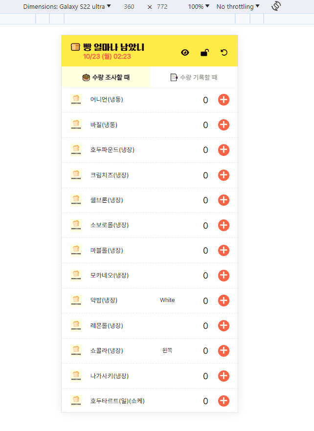
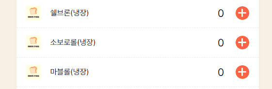
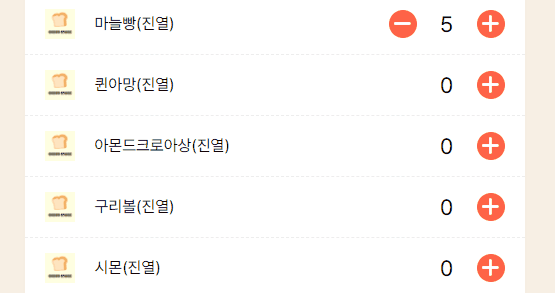
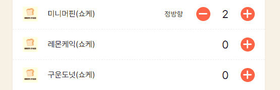
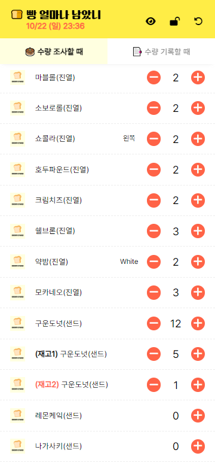
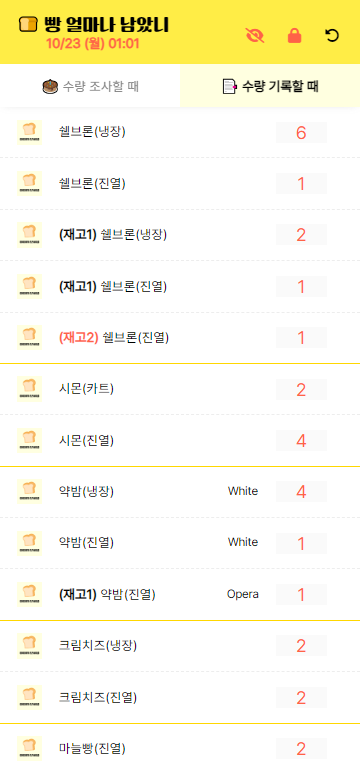

# 🍞 빵 얼마나 남았니

- https://rigood.github.io/bread-stock
- 현재 아르바이트 하고 있는 빵집에서 **`빵 일일 재고 현황을 쉽게 파악·기록`** 하기 위해 만든 앱입니다.
- 모든 데이터는 **`localStorage에 자동 저장`** 됩니다.

<br>

<br>

## 주요 기능

#### 수량 입력



- (➖), (➕) 버튼과 숫자 키보드로 수량을 입력할 수 있습니다.
- 수량이 0인 경우 (➖) 버튼은 표시되지 않습니다
- 모바일에서 키패드의 '다음' 버튼을 누르면 자동으로 커서가 다음 항목으로 이동합니다.

<br>

#### 재고 추가



- 빵 이름을 클릭하면, 재고를 추가할 수 있습니다. (최대 2회)

<br>

#### 빵 포장 방법 선택



- 빵 포장 방법을 선택할 수 있습니다. (ex: 포장 스티커 붙이는 방향에 따라 정방향/역방향)

<br>

#### 탭 선택

- [수량 조사 탭]: **빵이 진열된 위치에 따라 정렬**
- [수량 기록 탭]: **재고대장에 기록하는 순서에 따라 정렬**, 제품 구분선 표시

|             수량 조사              |             수량 기록              |
| :--------------------------------: | :--------------------------------: |
|  |  |

<br>

#### 상단 아이콘 3가지 기능

- 👁‍🗨 수량 0인 품목 숨기기
- 🔒 입력 / 잠금 모드
- ↩ 초기화


<br>

## 폴더 구조

```
📦 root
├─ 📦 public
│  ├─ 📂 icons
│  └─ 📜 index.html
└─ 📦 src
   ├─ 📂 assets
   │  ├─ 📂 fonts
   │  └─ 📂 images
   ├─ 📂 components
   │  ├─ 📜 BreadItem.jsx
   │  ├─ 📜 Header.jsx
   │  ├─ 📜 Clock.jsx
   │  └─ 📜 IconButton.jsx
   │  └─ 📜 TabButton.jsx
   │  └─ 📜 QuantityButton.jsx
   ├─ 📂 data
   │  ├─ 📜 bread-list.js
   │  ├─ 📜 bread-order-by-tab.js
   │  ├─ 📜 bread-packing-labels.js
   ├─ 📂 styles
   │  ├─ 📜 fonts.css
   │  ├─ 📜 global.css
   │  ├─ 📜 GlobalStyle.jsx
   ├─ 📂 utils
   ├─ 📜 App.jsx
   └─ 📜 index.js
   └─ 📜 constants.js
```

<br>

## 업데이트 기록

| **버전** |   **날짜**    |
| :------: | :-----------: |
|   1.0    | 2023. 3. 29.  |
|   1.1    | 2023. 4. 29.  |
|   2.0    | 2023. 10. 22. |

### ver 2.0

- 다중 조건 정렬
  - '수량 기록 탭' ① 빵 번호 → ② 재고 횟수 → ③ 빵 이름 순으로 정렬

```js
list.sort((a, b) => 첫번째 조건 || 두번째 조건 || 세번째 조건);
```

- React.memo를 활용하여 불필요한 리렌더링 방지
  - 기존: 수량 변경 시 모든 항목이 리렌더링됨
  - 개선: 수량을 변경한 항목만 리렌더링됨

```js
// App.js
sortedBreadList.map((bread) => {
  return (
    <BreadItem
      key={bread.id}
      bread={bread}
      isLastItem={findLastItem(bread.breadNo, bread.id)}
      isHidingZeroQuantity={isHidingZeroQuantity}
      isLocked={isLocked}
      setBreadList={setBreadList}
    />
  );
});

// BreadItem.jsx
const increaseQuantity = () => {
  setQuantity((prev) => prev + 1);
  setBreadList((breadList) =>
    breadList.map((bread) =>
      bread.id === id ? { ...bread, quantity: bread.quantity + 1 } : bread
    )
  );
};

export default React.memo(BreadItem);
```

- 중복되는 로직을 util 함수로 정의

```js
// localStorage에서 값 가져오기
function getItemFromLocalStroage(LOCALSTORAGE_KEY) {
  return JSON.parse(localStorage.getItem(LOCALSTORAGE_KEY));
}
// localStorage에 값 저장
function setItemInLocalStorage(LOCALSTORAGE_KEY, item) {
  return localStorage.setItem(LOCALSTORAGE_KEY, JSON.stringify(item));
}
```

- 재사용 가능한 컴포넌트 분리 (IconButton, QuantityButton, TabButton 등)
- 폴더 구조 정리 (assets, styles, utils, data 폴더 등)
- localStorage에 저장되는 자료 구조 변경
- 앱에 사용되는 color를 css 전역 변수로 정의하여 사용
- 하드코딩된 문자열을 상수화하여 constant.js 파일에서 관리
- 재고 추가 가능한 항목만 마우스 커서를 pointer로 변경
- 재고 여부/재고 횟수에 따라 text 스타일 변경

### ver 1.1

    - 수량 0인 품목 숨기기 기능 추가
    - 재고 추가 횟수 2회로 제한
