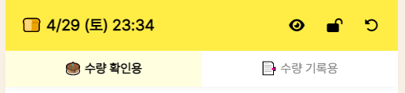

# 🍞 빵 얼마나 남았니

**현재 알바중인 빵집의 빵 일일 재고 현황을 쉽게 파악·기록하기 위해 만든 앱입니다.**

[빵 얼마나 남았니 바로가기](https://rigood.github.io/bread-stock)

 

## 주요 기능

- (-), (+) 버튼과 숫자 키보드를 통해 수량 입력
- 빵 이름 클릭 시, 해당 빵 재고 추가 가능

 

- 빵 포장 방법 선택 가능 (toggle)

 

- 정렬 순서 (수량 확인용, 수량 기록용)
- 👁‍🗨 수량 0인 품목 숨기기
- 🔒 입력 / 잠금 모드
- ↩ 초기화

 

## 업데이트 기록

| **버전** |   **날짜**   |
| :------: | :----------: |
|   1.0    | 2023. 3. 29. |
|   1.1    | 2023. 4. 29. |

### ver 1.1

    - 수량 0인 품목 숨기기 기능 추가
    - 재고 추가 횟수 2회로 제한
